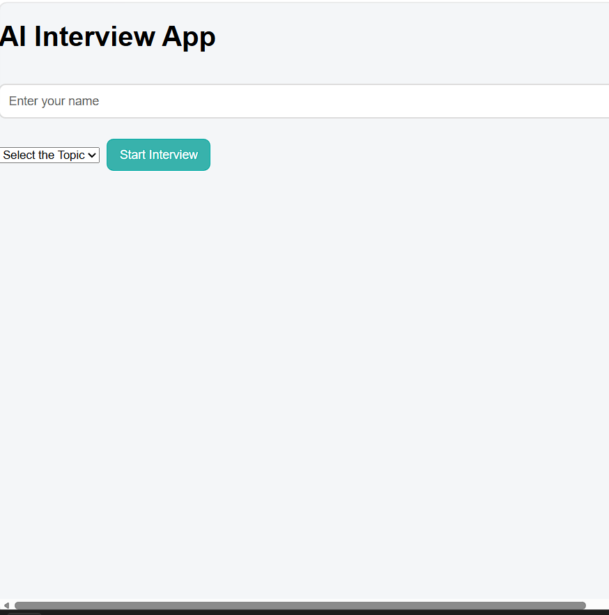
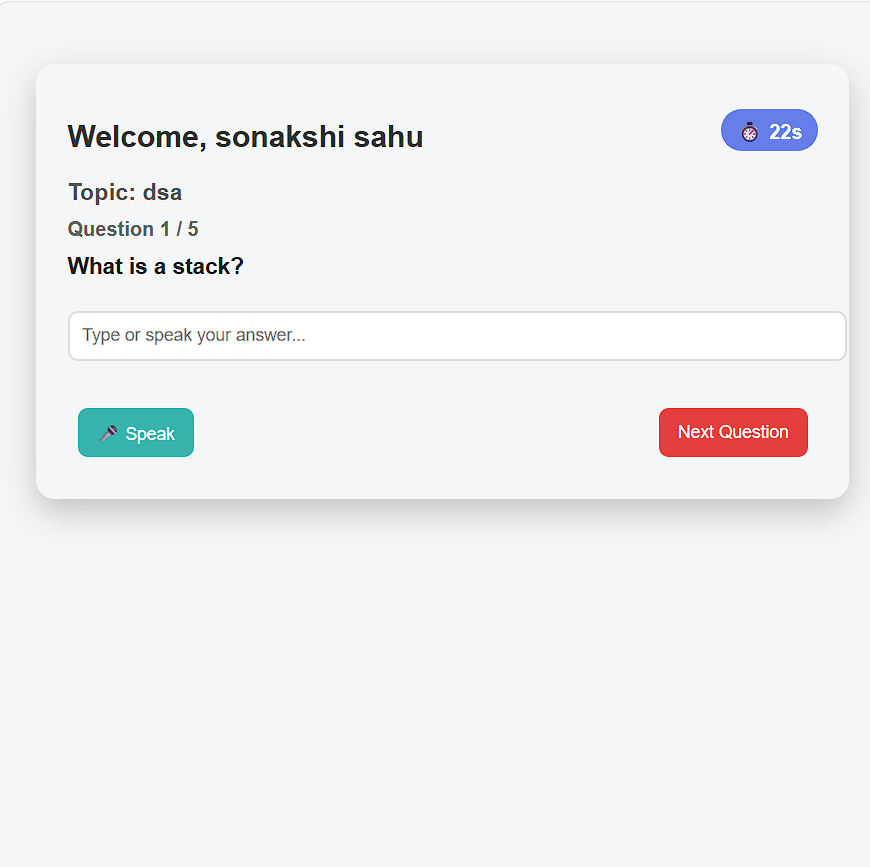
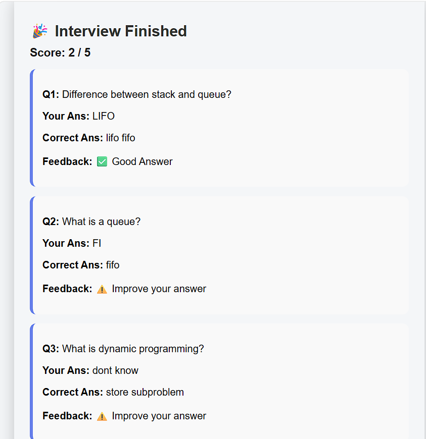
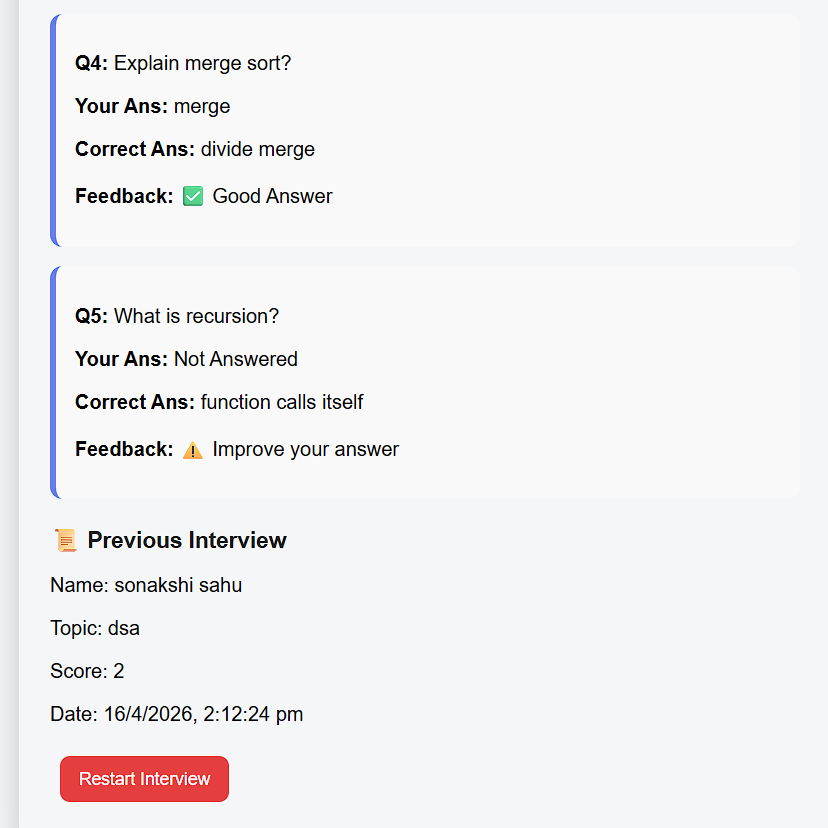

# 🤖 PrepWise AI

✨ An AI-powered interview preparation web application that simulates real interview scenarios with timer-based questions, voice input, scoring system, and performance tracking.

---

## 🌐 Live Demo

👉 Click here to view live app:  
🔗 https://prepwise-ai-omega.vercel.app


---

## 📸 Preview

  
  
  


---

## ✨ Features

- 📚 Topic-based question filtering  
- 🔀 Randomized questions every session  
- ⏱ Timer-based answering system (30 seconds per question)  
- 🎤 Voice input using Web Speech API  
- ⌨️ Manual typing input support  
- 📊 Real-time progress tracking  
- 🧮 Dynamic scoring system using keyword matching  
- 🤖 Smart feedback (Perfect / Good / Improve)  
- 💾 Save results in localStorage  
- 📜 View previous interview history  
- 🔄 Restart interview functionality  

---

## ⚙️ How It Works

- User enters their name and selects an interview topic  
- App loads and randomizes 5 relevant questions  
- Timer starts for each question  
- User answers using voice or text input  
- Answers are evaluated using keyword matching logic  
- Score is calculated dynamically  
- Final result and feedback is shown  
- Interview history is saved in localStorage  

---

## 🛠️ Tech Stack

- ⚛️ React.js (useState, useEffect)  
- 🎨 CSS  
- 🎤 Web Speech API  
- 💾 localStorage  
- 🌐 JavaScript  

---

## 📦 Installation

```bash
git clone https://github.com/sonakshi-sahu15/prepwise-ai.git
cd prepwise-ai
npm install
npm run dev
